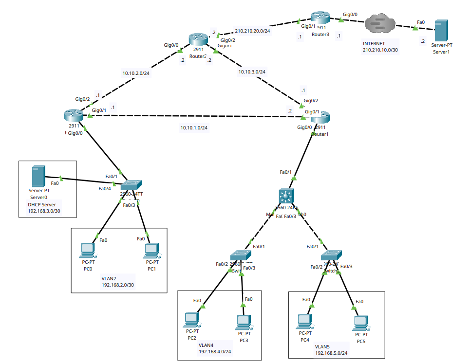
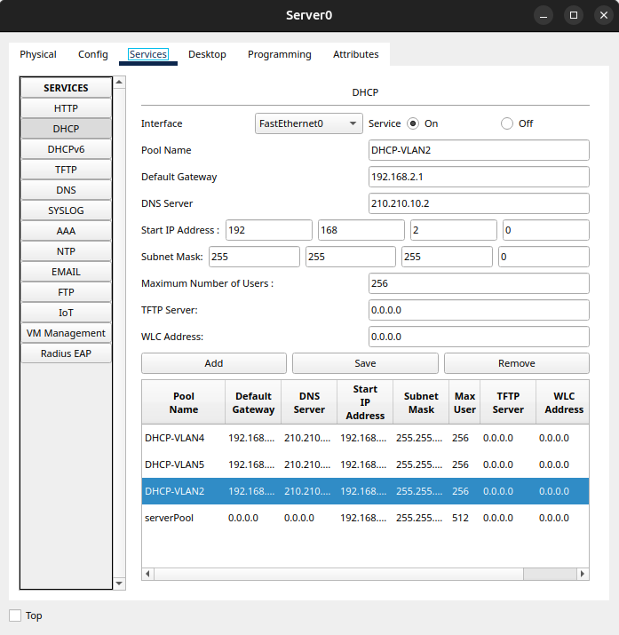

# Network Configuration

This document provides a detailed guide for setting up and configuring a network in Cisco Packet Tracer. The network employs NAT and DHCP to ensure secure communication between the server and the internet. The network includes six PCs, four routers (R1, R2, R3 in the local network, and R4 for internet access), and multiple segments for connectivity.

## Network Topology



### PCs

- Each PC is configured via DHCP.



## Router Configuration

### R0 Configuration

```plaintext
interface GigabitEthernet0/0
 no ip address
 duplex auto
 speed auto
! No IP address assigned to the main interface, used for sub-interfaces

interface GigabitEthernet0/0.2
 encapsulation dot1Q 2
 ip address 192.168.2.1 255.255.255.0
 ip helper-address 192.168.3.2
! Sub-interface for VLAN 2 with IP helper for DHCP relay

interface GigabitEthernet0/0.3
 encapsulation dot1Q 3
 ip address 192.168.3.1 255.255.255.0
! Sub-interface for VLAN 3

interface GigabitEthernet0/1
 ip address 10.10.1.1 255.255.255.252
 duplex auto
 speed auto
! Point-to-point link with R1

interface GigabitEthernet0/2
 ip address 10.10.2.1 255.255.255.252
 duplex auto
 speed auto
! Point-to-point link with R2

ip classless
ip route 192.168.4.0 255.255.255.0 10.10.1.2
ip route 192.168.5.0 255.255.255.0 10.10.1.2
ip route 210.210.20.0 255.255.255.0 10.10.2.2
ip route 210.210.10.0 255.255.255.0 10.10.2.2
! Static routes for internal network segments and external network

Router(config)#ip nat inside
! Enable NAT on the inside interface
```

### R1 Configuration

```plaintext
interface GigabitEthernet0/0
 ip address 10.10.10.1 255.255.255.0
 duplex auto
 speed auto
! Connection to the multilayer switch

interface GigabitEthernet0/1
 ip address 10.10.1.2 255.255.255.252
 duplex auto
 speed auto
! Point-to-point link with R0

interface GigabitEthernet0/2
 ip address 10.10.3.1 255.255.255.252
 duplex auto
 speed auto
! Point-to-point link with R2

ip classless
ip route 192.168.4.0 255.255.255.0 10.10.10.2
ip route 192.168.5.0 255.255.255.0 10.10.10.2
ip route 192.168.2.0 255.255.255.0 10.10.1.1
ip route 192.168.3.0 255.255.255.0 10.10.1.1
ip route 210.210.20.0 255.255.255.0 10.10.3.2
ip route 210.210.10.0 255.255.255.0 10.10.3.2
! Static routes for internal network segments and external network

ip flow-export version 9
! Enable NetFlow version 9

Router(config)#ip nat inside
! Enable NAT on the inside interface
```

### R2 Configuration

```plaintext
interface GigabitEthernet0/0
 ip address 10.10.2.2 255.255.255.252
 ip nat inside
 duplex auto
 speed auto
! Point-to-point link with R0

interface GigabitEthernet0/1
 ip address 10.10.3.2 255.255.255.252
 ip nat inside
 duplex auto
 speed auto
! Point-to-point link with R1

interface GigabitEthernet0/2
 ip address 210.210.20.2 255.255.255.252
 duplex auto
 speed auto
! Connection to the external network (internet)

ip classless
ip route 192.168.2.0 255.255.255.0 10.10.2.1
ip route 192.168.3.0 255.255.255.0 10.10.2.1
ip route 192.168.4.0 255.255.255.0 10.10.3.1
ip route 192.168.5.0 255.255.255.0 10.10.3.1
ip route 210.210.10.0 255.255.255.252 210.210.20.1
! Static routes for internal network segments and external network

ip flow-export version 9
! Enable NetFlow version 9

ip access-list standard FOR-NAT
 permit 192.168.2.0 0.0.0.255
 permit 192.168.3.0 0.0.0.255
 permit 192.168.4.0 0.0.0.255
 permit 192.168.5.0 0.0.0.255
! Access list for NAT

Router(config)#ip nat inside
! Enable NAT on the inside interface
```

### NAT Configuration on R2

```plaintext
interface GigabitEthernet0/0
 ip address 10.10.2.2 255.255.255.252
 ip nat inside
 duplex auto
 speed auto
! Point-to-point link with R0

interface GigabitEthernet0/1
 ip address 10.10.3.2 255.255.255.252
 ip nat inside
 duplex auto
 speed auto
! Point-to-point link with R1

interface GigabitEthernet0/2
 ip address 210.210.20.2 255.255.255.252
 duplex auto
 speed auto
! Connection to the external network (internet)

ip nat inside source list FOR-NAT interface GigabitEthernet0/1 overload
! NAT configuration with overload for internal IPs

ip classless
ip route 192.168.2.0 255.255.255.0 10.10.2.1 
ip route 192.168.3.0 255.255.255.0 10.10.2.1 
ip route 192.168.4.0 255.255.255.0 10.10.3.1 
ip route 192.168.5.0 255.255.255.0 10.10.3.1 
ip route 210.210.10.0 255.255.255.252 210.210.20.1 
! Static routes for internal network segments and external network

ip flow-export version 9
! Enable NetFlow version 9

ip access-list standard FOR-NAT
 permit 192.168.2.0 0.0.0.255
 permit 192.168.3.0 0.0.0.255
 permit 192.168.4.0 0.0.0.255
 permit 192.168.5.0 0.0.0.255
! Access list for NAT
```

## Multilayer Switch Configuration

```plaintext
hostname Switch
! Set switch hostname

ip routing
! Enable IP routing on the switch

spanning-tree mode pvst
! Enable PVST+ for spanning tree

interface FastEthernet0/1
 switchport access vlan 6
 switchport mode access
! Configure port for VLAN 6

interface FastEthernet0/2
 switchport trunk allowed vlan 4
 switchport trunk encapsulation dot1q
 switchport mode trunk
! Configure trunk port allowing VLAN 4

interface FastEthernet0/3
 switchport trunk allowed vlan 5
 switchport trunk encapsulation dot1q
 switchport mode trunk
! Configure trunk port allowing VLAN 5

interface Vlan4
 mac-address 000a.f366.1901
 ip address 192.168.4.1 255.255.255.0
 ip helper-address 192.168.3.2
! VLAN 4 interface with DHCP relay

interface Vlan5
 mac-address 000a.f366.1902
 ip address 192.168.5.1 255.255.255.0
 ip helper-address 192.168.3.2
! VLAN 5 interface with DHCP relay

interface Vlan6
 mac-address 000a.f366.1903
 ip address 10.10.10.2 255.255.255.0
! VLAN 6 interface

ip classless
ip route 0.0.0.0 0.0.0.0 10.10.10.1
! Default route pointing to R1
```

---

This README.md provides detailed and formatted instructions for setting up and configuring the network